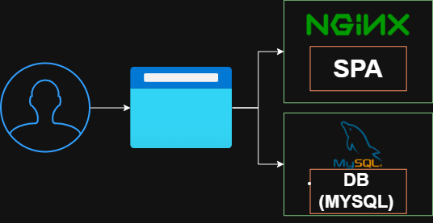

# GS-CLOUD-DEVOPS — Trilha A
Deploy de SPA sobre Trabalho com Inteligência Artificial usando Docker multi-containers

## 1. Trilha escolhida
**Trilha A — Deploy com Docker (multi-containers)**

## 2. Integrantes do grupo
- Lucas Buzato Venarusso RM562332
- Larissa Vicenzi RM566506
- Luana Gomes Silva RM563284
- Melyssa Santos RM564268

## 3. Explicação detalhada do ambiente
O projeto utiliza dois containers Docker, orquestrados pelo `docker-compose`:

1. **web**: Container Nginx que serve a SPA localizada em `app/dist`.  
2. **db**: Container MySQL 8 com banco `gs_ai`, contendo tabela `VagasIA` populada via scripts SQL (`schema.sql` e `seed.sql`).

O ambiente permite subir a SPA e o banco de dados de forma isolada e reproduzível, sem depender de instalações locais no host.

## 4. Descrição sucinta da solução
O projeto apresenta uma SPA sobre **Trabalho com Inteligência Artificial**, abordando carreiras, competências e tendências futuras. O banco MySQL é utilizado para demonstração de provisionamento e validação de dados.

## 5. Pré-requisitos
- Docker instalado (https://www.docker.com/)  
- Docker Compose instalado  
- Terminal (Windows, Linux ou Mac)  
- Internet para baixar imagens Docker

## 6. Estrutura de pastas do projeto
``` bash
GS-CLOUD-DEVOPS-MAIN
├── app
│ ├── dist
│ │ ├── imgs
│ │ ├── js
│ │ ├── index.html
│ │ └── style.css
│ └── src
│ └── input.css
├── db
│ ├── schema.sql
│ └── seed.sql
├── ops
│ ├── docker-compose.yml
│ └── Dockerfile
└── README.md
```

## 7. Comandos utilizados
```bash
# Build das imagens
docker compose build

# Subir containers em segundo plano
docker compose up -d

# Verificar status dos containers
docker compose ps

# Parar e remover containers + volumes
docker compose down -v

# Acessar MySQL dentro do container
docker compose exec db mysql -u root -p
# senha: senha123
```

## 9. Validando a aplicação
- SPA acessível em http://localhost:8080
- Banco MySQL com tabela VagasIA contendo os registros do seed.sql

## 10. Solução de problemas comuns
| Problema                         | Solução                                                      |
|----------------------------------|-------------------------------------------------------------|
| Tabela VagasIA não aparece        | Execute `docker compose down -v` e depois `docker compose up -d` |
| Porta 8080 já em uso              | Altere a porta no `docker-compose.yml` para outra, ex: `"8081:80"` |
| Cliente MySQL não instalado no host | Use `docker compose exec db mysql -u root -p`             |

## 11. Diagrama de arquitetura
Usuário → Navegador → Container Nginx (web) → SPA
                     ↘ Container MySQL (db) → Banco gs_ai (tabela VagasIA)



- web (Nginx): Serve a SPA
- db (MySQL): Banco populado via scripts SQL

## 12. Evidências obrigatórias
- Containers ativos: docker compose ps
- SPA acessível em navegador
- Banco MySQL populado com tabela VagasIA
- Consultas SQL retornando registros corretamente

## 13. Links importantes
- Repositório GitHub: https://github.com/lucasbuzato/gs-cloud-devops
- Vídeo avaliativo no YouTube: <link-do-video>